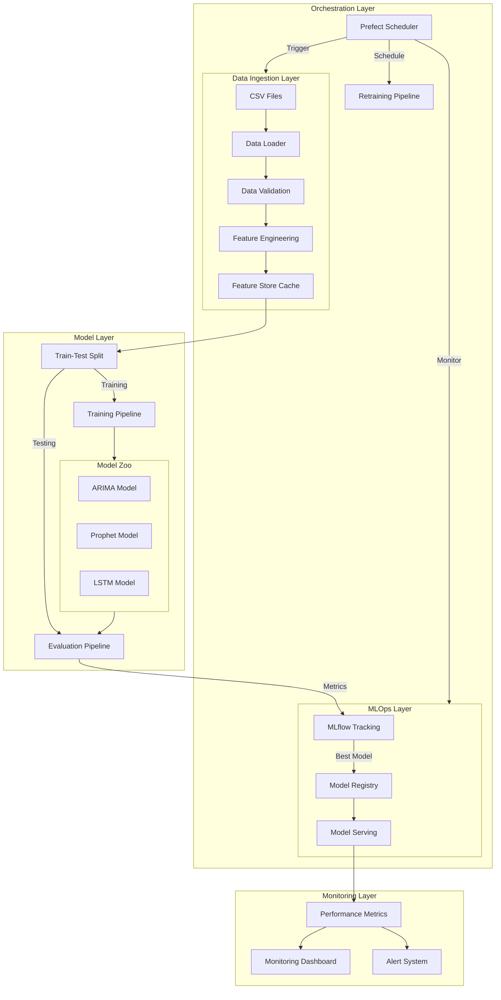
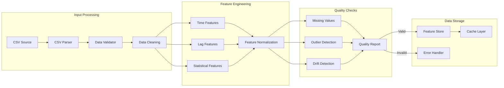
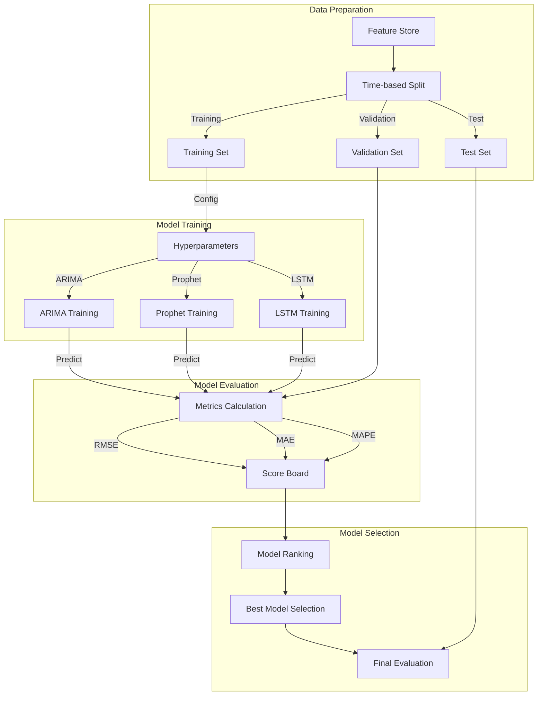
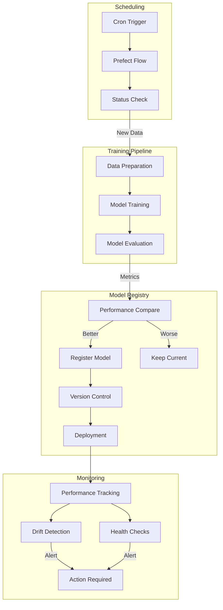
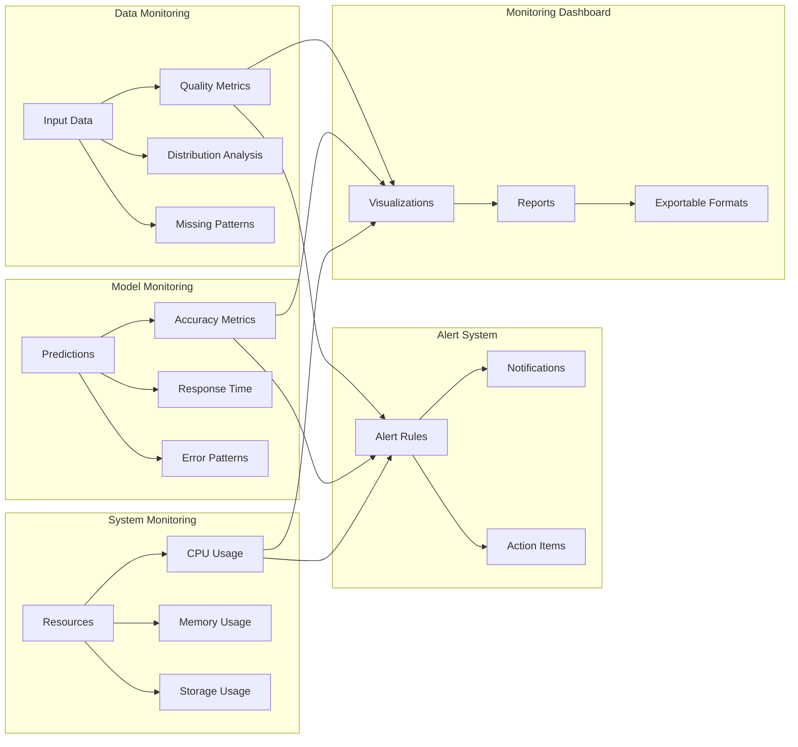
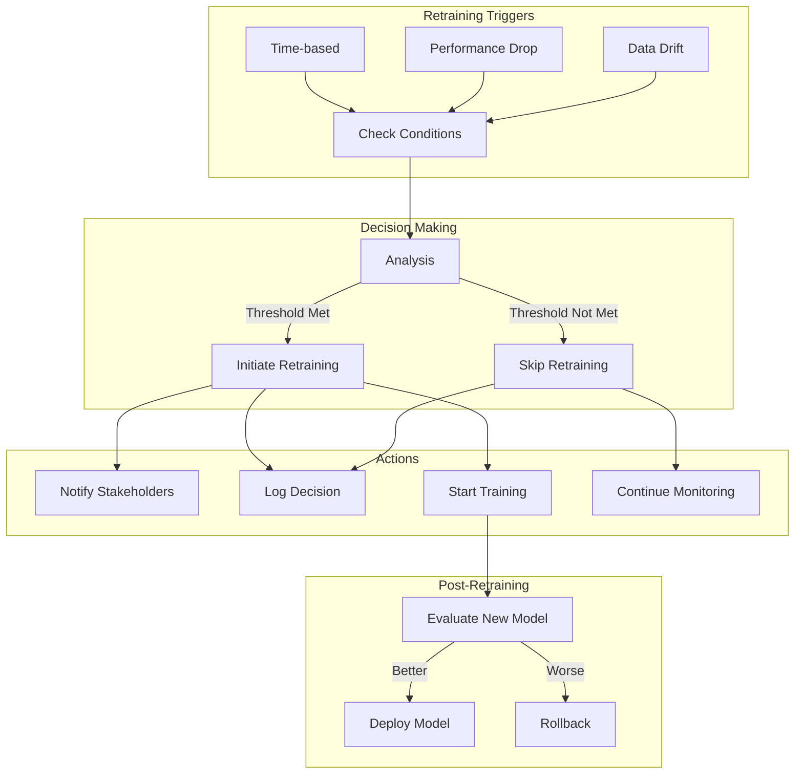

# System Architecture Diagrams

## 1. Overall System Architecture

## 2. Data Processing Pipeline

## 3. Model Training Workflow

## 4. MLOps Pipeline

## 5. Monitoring System

## 6. Retraining Decision Flow
