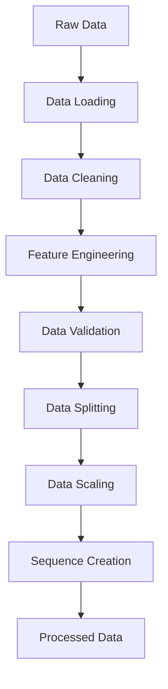

# Data Pipeline

This document describes the data processing pipeline for the Store Sales Time Series Forecasting System.

## Data Sources

The system uses the following data sources from the Favorita store sales dataset:

1. **train.csv**:
   - Daily sales data
   - Features: store_nbr, family, sales, onpromotion
   - Time range: 2013-01-01 to 2017-08-15

2. **test.csv**:
   - Prediction period data
   - Features: id, store_nbr, family, onpromotion
   - Time range: 2017-08-16 to 2017-08-31

3. **stores.csv**:
   - Store metadata
   - Features: store_nbr, city, state, type, cluster

4. **oil.csv**:
   - Daily oil price data
   - Features: date, dcoilwtico
   - Time range: 2013-01-01 to 2017-08-31

5. **holidays_events.csv**:
   - Holiday and event information
   - Features: date, type, locale, locale_name, description, transferred

6. **transactions.csv**:
   - Daily transaction counts per store
   - Features: date, store_nbr, transactions

## Data Processing Flow



### 1. Data Loading (`DataProcessor.load_data`)

```python
def load_data(self, data_dir: str) -> Dict[str, pd.DataFrame]:
    """
    Load all required datasets.
    
    Args:
        data_dir: Path to data directory
        
    Returns:
        Dictionary of DataFrames
    """
```

- Loads CSV files using pandas
- Converts date columns to datetime
- Performs initial type conversions
- Handles missing files gracefully

### 2. Data Cleaning (`DataProcessor._process_*`)

#### Sales Data
```python
def _process_sales_data(self, df: pd.DataFrame) -> pd.DataFrame:
    """Process sales data."""
    # Fill missing sales with 0
    # Fill missing onpromotion with False
    # Add date components (year, month, day)
    # Sort by date and store
```

#### Oil Data
```python
def _process_oil_data(self, df: pd.DataFrame) -> pd.DataFrame:
    """Process oil price data."""
    # Forward fill missing values
    # Backward fill remaining missing values
    # Sort by date
```

#### Holiday Data
```python
def _process_holidays_data(self, df: pd.DataFrame) -> pd.DataFrame:
    """Process holiday and event data."""
    # Create one-hot encoded features for type and locale
    # Handle transferred dates
    # Combine overlapping events
```

#### Transaction Data
```python
def _process_transactions_data(self, df: pd.DataFrame) -> pd.DataFrame:
    """Process transaction data."""
    # Fill missing values with store-specific means
    # Sort by date and store
```

### 3. Feature Engineering (`FeatureEngineer`)

#### Time-Based Features
```python
def create_time_features(self, data: pd.DataFrame) -> pd.DataFrame:
    """Create time-based features."""
    # Day of week (cyclic)
    # Month (cyclic)
    # Day of month (cyclic)
    # Week of year
    # Is weekend
    # Is holiday
```

#### Lag Features
```python
def create_lag_features(
    self,
    data: pd.DataFrame,
    target_col: str,
    lag_periods: List[int]
) -> pd.DataFrame:
    """Create lagged features."""
    # Previous day
    # Previous week
    # Previous month
    # Previous year
```

#### Rolling Features
```python
def create_rolling_features(
    self,
    data: pd.DataFrame,
    target_col: str,
    windows: List[int],
    statistics: List[str]
) -> pd.DataFrame:
    """Create rolling window features."""
    # Moving averages
    # Moving standard deviation
    # Moving min/max
    # Moving median
```

#### Interaction Features
```python
def create_interaction_features(
    self,
    data: pd.DataFrame,
    feature_pairs: List[tuple]
) -> pd.DataFrame:
    """Create interaction features."""
    # Store type × holiday
    # Product family × promotion
    # Store cluster × weekday
```

### 4. Data Validation

The pipeline includes several validation checks:

1. **Schema Validation**:
   ```python
   def validate_schema(self, data: pd.DataFrame) -> bool:
       """Check if data matches expected schema."""
       required_columns = [...]
       required_types = {...}
   ```

2. **Range Checks**:
   ```python
   def validate_ranges(self, data: pd.DataFrame) -> bool:
       """Check if values are within expected ranges."""
       value_ranges = {
           'sales': (0, np.inf),
           'onpromotion': (0, 1),
           ...
       }
   ```

3. **Consistency Checks**:
   ```python
   def validate_consistency(self, data: pd.DataFrame) -> bool:
       """Check data consistency."""
       # Date continuity
       # Store presence
       # Family consistency
   ```

### 5. Data Splitting (`DataProcessor.split_data`)

```python
def split_data(
    self,
    data: pd.DataFrame,
    test_size: float = 0.2
) -> Tuple[pd.DataFrame, pd.DataFrame]:
    """Split data into train and test sets."""
    # Time-based split
    # Preserve store grouping
    # Handle validation split
```

### 6. Data Scaling (`DataProcessor.scale_features`)

```python
def scale_features(
    self,
    train_data: pd.DataFrame,
    test_data: pd.DataFrame,
    feature_columns: List[str]
) -> Tuple[pd.DataFrame, pd.DataFrame]:
    """Scale numerical features."""
    # Fit scaler on training data
    # Transform both train and test
    # Store scaler for inference
```

### 7. Sequence Creation (`DataProcessor.create_sequences`)

```python
def create_sequences(
    self,
    data: pd.DataFrame,
    target_col: str = 'sales',
    sequence_length: int = 30,
    prediction_horizon: int = 15
) -> Tuple[np.ndarray, np.ndarray]:
    """Create sequences for LSTM model."""
    # Sliding window approach
    # Handle multiple stores
    # Create X (features) and y (targets)
```

## Data Quality Metrics

The pipeline tracks several data quality metrics:

1. **Completeness**:
   - Missing value rates
   - Coverage of stores/products
   - Time series continuity

2. **Consistency**:
   - Value range violations
   - Relationship violations
   - Temporal consistency

3. **Timeliness**:
   - Data freshness
   - Processing delays
   - Update frequency

4. **Accuracy**:
   - Outlier rates
   - Anomaly scores
   - Statistical properties

## Data Drift Detection

The system monitors several types of drift:

1. **Feature Drift**:
   ```python
   def detect_feature_drift(
       self,
       reference_data: pd.DataFrame,
       current_data: pd.DataFrame
   ) -> Dict[str, float]:
       """Detect drift in feature distributions."""
       # KS test for continuous features
       # Chi-square test for categorical
   ```

2. **Target Drift**:
   ```python
   def detect_target_drift(
       self,
       reference_data: pd.DataFrame,
       current_data: pd.DataFrame
   ) -> Dict[str, float]:
       """Detect drift in target variable."""
       # Distribution tests
       # Mean/variance tests
   ```

3. **Concept Drift**:
   ```python
   def detect_concept_drift(
       self,
       reference_performance: Dict[str, float],
       current_performance: Dict[str, float]
   ) -> Dict[str, float]:
       """Detect drift in model performance."""
       # Performance metric changes
       # Error pattern changes
   ```

## Pipeline Configuration

The pipeline is configured through YAML files:

1. **Data Config**:
   ```yaml
   data_processing:
     missing_value_strategy: forward_fill
     outlier_threshold: 3
     validation_checks: true
     
   feature_engineering:
     lag_periods: [1, 7, 30, 365]
     rolling_windows: [7, 30, 90]
     rolling_stats: [mean, std, min, max]
     
   sequence_creation:
     sequence_length: 30
     prediction_horizon: 15
     stride: 1
   ```

2. **Validation Config**:
   ```yaml
   validation:
     schema:
       required_columns: [...]
       column_types: {...}
     
     ranges:
       sales: [0, inf]
       onpromotion: [0, 1]
       
     consistency:
       check_dates: true
       check_stores: true
   ```

## Error Handling

The pipeline includes robust error handling:

1. **Data Loading Errors**:
   ```python
   try:
       df = pd.read_csv(file_path)
   except FileNotFoundError:
       logger.error(f"Data file not found: {file_path}")
       raise
   except pd.errors.EmptyDataError:
       logger.error(f"Empty data file: {file_path}")
       raise
   ```

2. **Processing Errors**:
   ```python
   try:
       processed_data = self._process_data(raw_data)
   except ValueError as e:
       logger.error(f"Processing error: {str(e)}")
       raise
   except Exception as e:
       logger.error(f"Unexpected error: {str(e)}")
       raise
   ```

3. **Validation Errors**:
   ```python
   try:
       is_valid = self.validate_data(processed_data)
       if not is_valid:
           raise ValueError("Data validation failed")
   except Exception as e:
       logger.error(f"Validation error: {str(e)}")
       raise
   ```

## Logging and Monitoring

The pipeline includes comprehensive logging:

1. **Processing Logs**:
   ```python
   logger.info("Starting data processing")
   logger.debug(f"Processing file: {file_path}")
   logger.warning(f"Missing values found: {missing_count}")
   logger.error(f"Processing failed: {error_msg}")
   ```

2. **Metrics Logging**:
   ```python
   mlflow.log_metric("missing_rate", missing_rate)
   mlflow.log_metric("outlier_rate", outlier_rate)
   mlflow.log_metric("processing_time", processing_time)
   ```

3. **Artifact Logging**:
   ```python
   mlflow.log_artifact("data_quality_report.html")
   mlflow.log_artifact("feature_distributions.png")
   mlflow.log_artifact("validation_results.json")
   ``` 