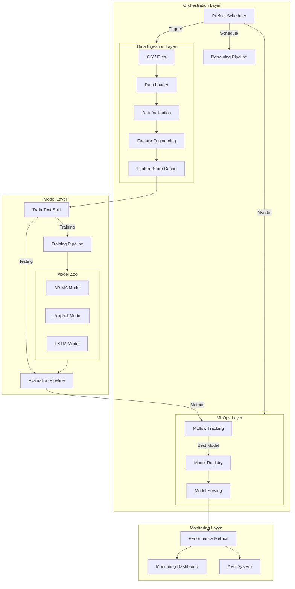
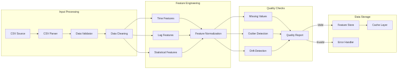
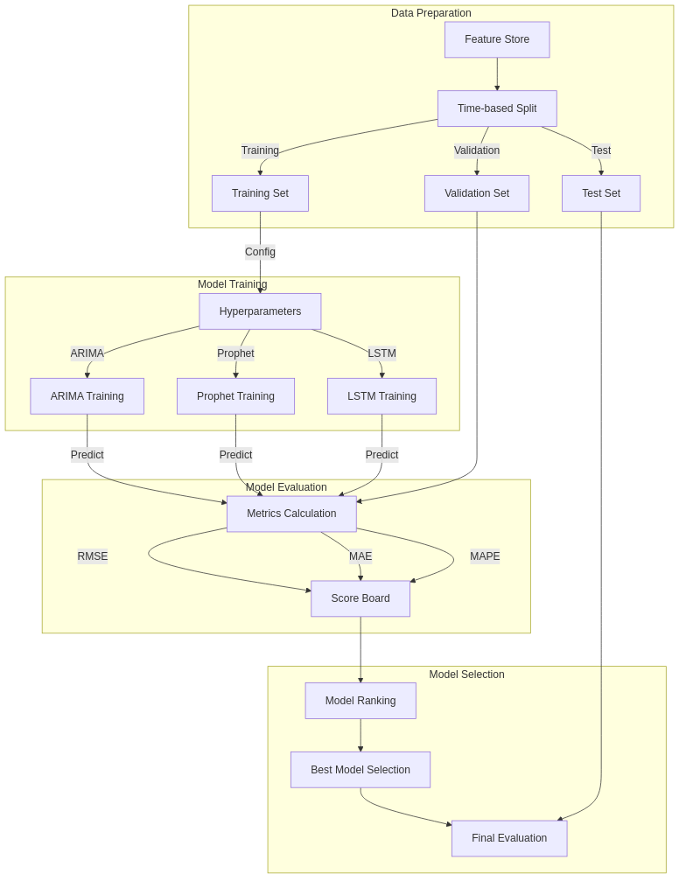
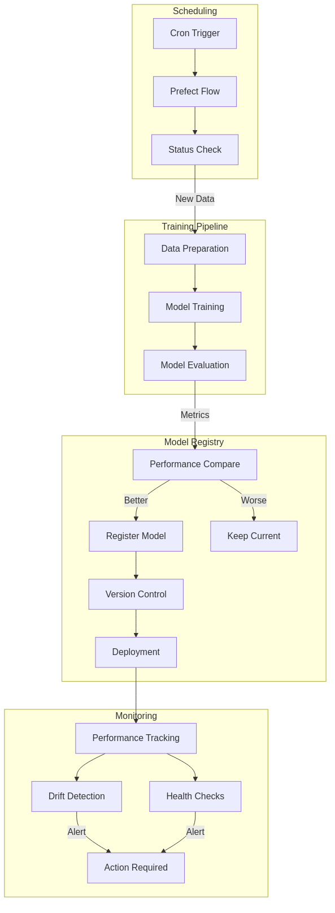
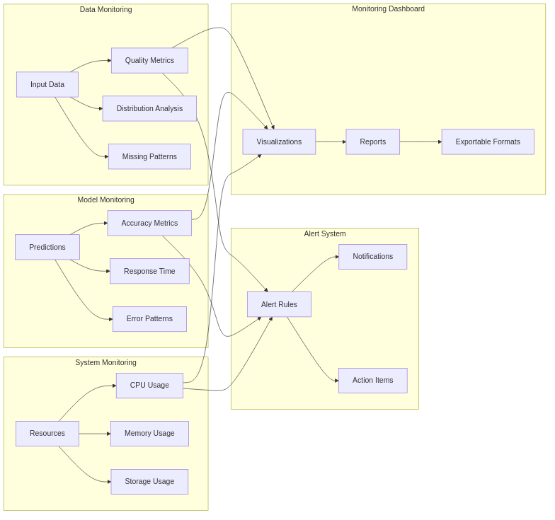
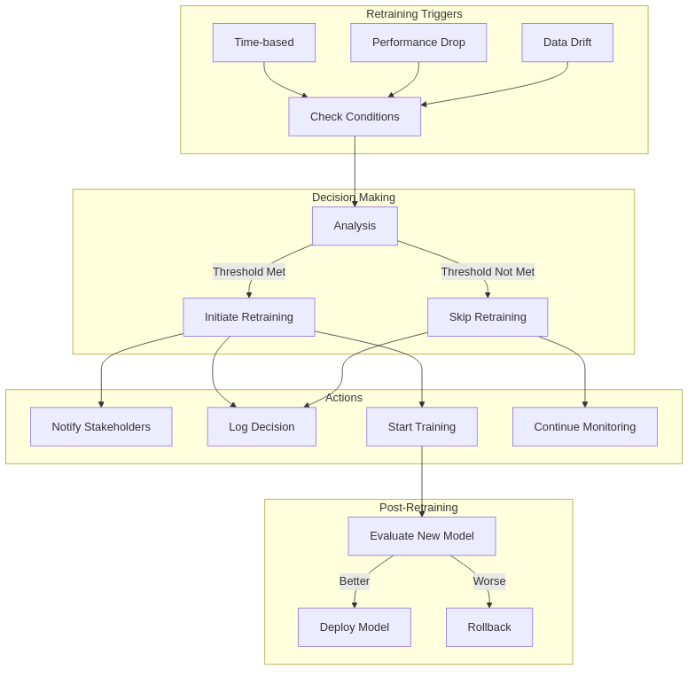

# System Architecture Diagrams

This directory contains detailed architectural diagrams for our time series forecasting system. Each diagram focuses on a specific aspect of the system.

## 1. Overall System Architecture


This diagram shows the complete system architecture including:
- Data Ingestion Layer
- Model Layer
- MLOps Layer
- Orchestration Layer
- Monitoring Layer

## 2. Data Processing Pipeline


Details the complete data flow including:
- Input Processing
- Feature Engineering
- Quality Checks
- Data Storage

## 3. Model Training Workflow


Illustrates the training process including:
- Data Preparation
- Model Training (ARIMA, Prophet, LSTM)
- Model Evaluation
- Model Selection

## 4. MLOps Pipeline


Shows the MLOps workflow including:
- Scheduling
- Training Pipeline
- Model Registry
- Monitoring

## 5. Monitoring System


Details the monitoring setup including:
- Data Monitoring
- Model Monitoring
- System Monitoring
- Alerts
- Dashboard

## 6. Retraining Decision Flow


Shows the retraining logic including:
- Retraining Triggers
- Decision Making
- Actions
- Post-Retraining Validation

## Usage

These diagrams serve as a reference for:
1. Understanding system components and their interactions
2. Planning implementations
3. Onboarding new team members
4. System documentation
5. Architecture discussions

## Maintenance

The diagrams are maintained in the `docs/diagrams` directory as Mermaid files (`.mmd`). To update:

1. Edit the relevant `.mmd` file
2. Run the generation script:
   ```bash
   ./generate_diagrams.sh
   ```
3. Commit both the `.mmd` and `.png` files 