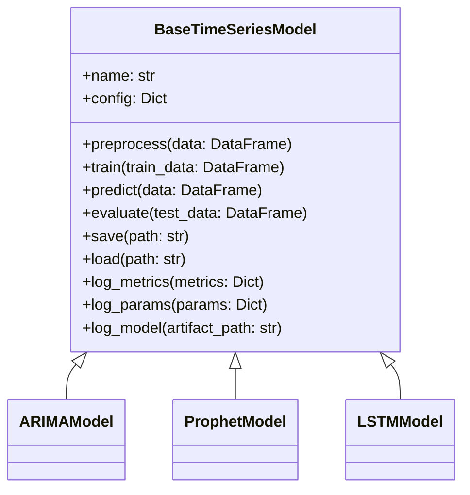
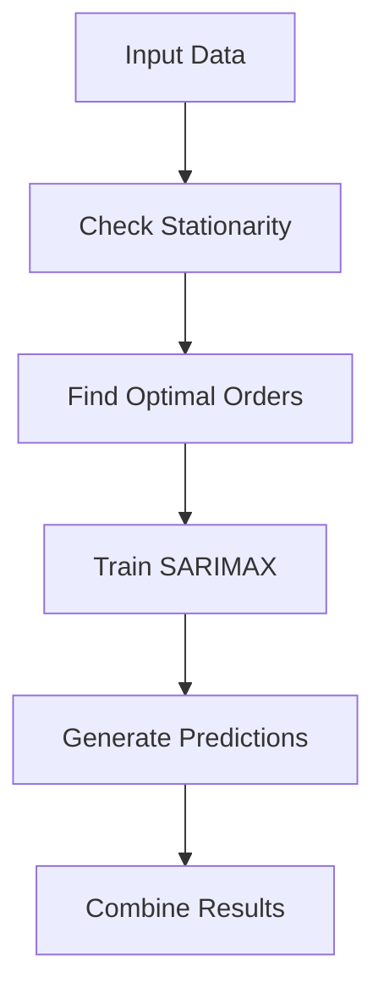
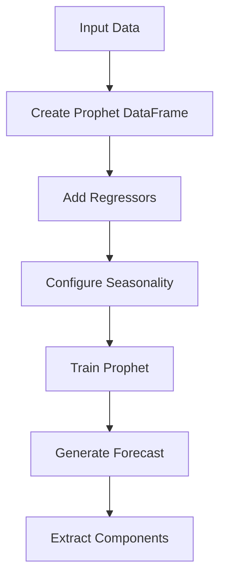
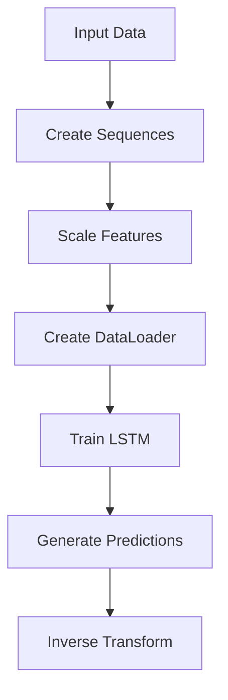

# Model Architecture

This document describes the model architecture of the Store Sales Time Series Forecasting System.

## Overview

The system implements three different time series forecasting models:
1. ARIMA (Statistical)
2. Prophet (Decomposition)
3. LSTM (Deep Learning)

Each model inherits from a common base class that provides unified interfaces for training, prediction, and evaluation.

## Base Model Interface



### Base Model Implementation

```python
class BaseTimeSeriesModel(ABC):
    """Abstract base class for time series models."""
    
    def __init__(self, name: str, config_path: str):
        self.name = name
        self.config = self._load_config(config_path)
        self.mlflow_tracker = MLflowTracker()
        
    @abstractmethod
    def preprocess(
        self,
        data: pd.DataFrame,
        is_training: bool = True
    ) -> Tuple[np.ndarray, Optional[np.ndarray]]:
        """Preprocess data for model."""
        pass
        
    @abstractmethod
    def train(
        self,
        train_data: pd.DataFrame,
        validation_data: Optional[pd.DataFrame] = None
    ) -> Dict[str, float]:
        """Train the model."""
        pass
        
    @abstractmethod
    def predict(
        self,
        data: pd.DataFrame,
        prediction_steps: int
    ) -> np.ndarray:
        """Generate predictions."""
        pass
        
    def evaluate(
        self,
        test_data: pd.DataFrame,
        metrics: List[str] = ['mse', 'mae', 'mape']
    ) -> Dict[str, float]:
        """Evaluate model performance."""
        predictions = self.predict(test_data)
        return calculate_metrics(test_data, predictions, metrics)
```

## ARIMA Model

The ARIMA model uses statsmodels' SARIMAX implementation for each store-product combination.

### Architecture



### Implementation

```python
class ARIMAModel(BaseTimeSeriesModel):
    """ARIMA model implementation."""
    
    def __init__(
        self,
        name: str = "arima",
        config_path: str = "configs/model_configs/default.yaml"
    ):
        super().__init__(name, config_path)
        self.models = {}  # Store-specific models
        
    def _check_stationarity(
        self,
        series: pd.Series
    ) -> Tuple[bool, float]:
        """Check series stationarity using ADF test."""
        adf_test = adfuller(series)
        return adf_test[1] < 0.05, adf_test[1]
        
    def _find_optimal_order(
        self,
        data: pd.Series,
        max_p: int = 5,
        max_d: int = 2,
        max_q: int = 5,
        seasonal: bool = True
    ) -> Tuple[tuple, Optional[tuple]]:
        """Find optimal ARIMA orders using auto_arima."""
        model = pm.auto_arima(
            data,
            start_p=0, max_p=max_p,
            start_q=0, max_q=max_q,
            max_d=max_d,
            seasonal=seasonal,
            trace=True,
            error_action='ignore',
            suppress_warnings=True,
            stepwise=True
        )
        return model.order, model.seasonal_order
```

## Prophet Model

The Prophet model uses Facebook's Prophet library for decomposition-based forecasting.

### Architecture



### Implementation

```python
class ProphetModel(BaseTimeSeriesModel):
    """Prophet model implementation."""
    
    def __init__(
        self,
        name: str = "prophet",
        config_path: str = "configs/model_configs/default.yaml"
    ):
        super().__init__(name, config_path)
        self.models = {}  # Store-specific models
        
    def _create_prophet_df(
        self,
        data: pd.DataFrame,
        store_nbr: int
    ) -> pd.DataFrame:
        """Create Prophet-specific DataFrame."""
        df = pd.DataFrame({
            'ds': data['date'],
            'y': data['sales'],
            'onpromotion': data['onpromotion'],
            'transactions': data['transactions'],
            'oil_price': data['dcoilwtico']
        })
        return df
        
    def _create_model(self, store_nbr: int) -> Prophet:
        """Create a Prophet instance with configuration."""
        model = Prophet(
            seasonality_mode=self.config['seasonality_mode'],
            changepoint_prior_scale=self.config['changepoint_prior_scale']
        )
        # Add regressors
        model.add_regressor('onpromotion')
        model.add_regressor('transactions')
        model.add_regressor('oil_price')
        return model
```

## LSTM Model

The LSTM model uses PyTorch for deep learning-based forecasting.

### Architecture



### Implementation

```python
class LSTMModel(BaseTimeSeriesModel):
    """LSTM model implementation."""
    
    def __init__(
        self,
        name: str = "lstm",
        config_path: str = "configs/model_configs/default.yaml"
    ):
        super().__init__(name, config_path)
        self.device = torch.device(
            "cuda" if torch.cuda.is_available() else "cpu"
        )
        self.model = self._build_model()
        self.scaler = StandardScaler()
        
    def _build_model(self) -> nn.Module:
        """Build LSTM neural network."""
        return LSTMNetwork(
            input_size=self.config['input_size'],
            hidden_size=self.config['hidden_size'],
            num_layers=self.config['num_layers'],
            dropout=self.config['dropout']
        )
        
    class LSTMNetwork(nn.Module):
        """LSTM neural network architecture."""
        
        def __init__(
            self,
            input_size: int,
            hidden_size: int,
            num_layers: int,
            dropout: float
        ):
            super().__init__()
            self.lstm = nn.LSTM(
                input_size=input_size,
                hidden_size=hidden_size,
                num_layers=num_layers,
                dropout=dropout,
                batch_first=True
            )
            self.fc = nn.Linear(hidden_size, 1)
```

## Model Comparison

### Feature Support

| Feature | ARIMA | Prophet | LSTM |
|---------|-------|---------|------|
| Multiple Seasonality | ✓ | ✓ | ✓ |
| External Regressors | ✓ | ✓ | ✓ |
| Missing Values | ✗ | ✓ | ✗ |
| Non-linear Patterns | ✗ | ✓ | ✓ |
| Long-term Dependencies | ✗ | ✓ | ✓ |
| Uncertainty Estimates | ✓ | ✓ | ✗ |

### Performance Characteristics

| Aspect | ARIMA | Prophet | LSTM |
|--------|-------|---------|------|
| Training Speed | Fast | Medium | Slow |
| Prediction Speed | Fast | Fast | Fast |
| Memory Usage | Low | Medium | High |
| GPU Support | ✗ | ✗ | ✓ |
| Scalability | Low | Medium | High |

### Use Cases

1. **ARIMA**:
   - Short-term forecasting
   - Clear seasonal patterns
   - Limited external factors
   - Single store/product focus

2. **Prophet**:
   - Multiple seasonality
   - Holiday effects
   - Missing data
   - Automatic feature handling

3. **LSTM**:
   - Complex patterns
   - Many external factors
   - Long sequences
   - Non-linear relationships

## Model Configuration

### ARIMA Configuration

```yaml
arima:
  # Model parameters
  max_p: 5
  max_d: 2
  max_q: 5
  seasonal: true
  
  # Training parameters
  information_criterion: aic
  stepwise: true
  trace: true
  
  # Prediction parameters
  alpha: 0.05  # confidence interval
```

### Prophet Configuration

```yaml
prophet:
  # Model parameters
  seasonality_mode: multiplicative
  changepoint_prior_scale: 0.05
  seasonality_prior_scale: 10.0
  holidays_prior_scale: 10.0
  
  # Component parameters
  yearly_seasonality: true
  weekly_seasonality: true
  daily_seasonality: false
  
  # Prediction parameters
  uncertainty_samples: 1000
```

### LSTM Configuration

```yaml
lstm:
  # Network architecture
  input_size: 10
  hidden_size: 64
  num_layers: 2
  dropout: 0.2
  
  # Training parameters
  batch_size: 32
  epochs: 100
  learning_rate: 0.001
  early_stopping_patience: 10
  
  # Sequence parameters
  sequence_length: 30
  prediction_horizon: 15
```

## Model Persistence

### Saving Models

```python
def save(self, path: str):
    """Save model to disk."""
    if isinstance(self, ARIMAModel):
        # Save SARIMAX models
        joblib.dump(self.models, path)
    elif isinstance(self, ProphetModel):
        # Save Prophet models
        with open(path, 'wb') as f:
            pickle.dump(self.models, f)
    elif isinstance(self, LSTMModel):
        # Save PyTorch model
        torch.save({
            'model_state_dict': self.model.state_dict(),
            'scaler': self.scaler
        }, path)
```

### Loading Models

```python
def load(self, path: str):
    """Load model from disk."""
    if isinstance(self, ARIMAModel):
        # Load SARIMAX models
        self.models = joblib.load(path)
    elif isinstance(self, ProphetModel):
        # Load Prophet models
        with open(path, 'rb') as f:
            self.models = pickle.load(f)
    elif isinstance(self, LSTMModel):
        # Load PyTorch model
        checkpoint = torch.load(path)
        self.model.load_state_dict(checkpoint['model_state_dict'])
        self.scaler = checkpoint['scaler']
```

## Model Evaluation

### Metrics

```python
def calculate_metrics(
    actual: np.ndarray,
    predicted: np.ndarray,
    metrics: List[str]
) -> Dict[str, float]:
    """Calculate evaluation metrics."""
    results = {}
    
    if 'mse' in metrics:
        results['mse'] = mean_squared_error(actual, predicted)
    if 'rmse' in metrics:
        results['rmse'] = np.sqrt(results['mse'])
    if 'mae' in metrics:
        results['mae'] = mean_absolute_error(actual, predicted)
    if 'mape' in metrics:
        results['mape'] = mean_absolute_percentage_error(
            actual, predicted
        )
        
    return results
```

### Cross-validation

```python
def cross_validate(
    self,
    data: pd.DataFrame,
    n_splits: int = 5
) -> Dict[str, List[float]]:
    """Perform time series cross-validation."""
    cv = TimeSeriesSplit(n_splits=n_splits)
    metrics = defaultdict(list)
    
    for train_idx, val_idx in cv.split(data):
        train_data = data.iloc[train_idx]
        val_data = data.iloc[val_idx]
        
        self.train(train_data)
        val_metrics = self.evaluate(val_data)
        
        for metric, value in val_metrics.items():
            metrics[metric].append(value)
            
    return metrics
```

## Model Monitoring

### Performance Monitoring

```python
def monitor_performance(
    self,
    predictions: np.ndarray,
    actuals: np.ndarray
) -> Dict[str, float]:
    """Monitor model performance."""
    metrics = calculate_metrics(actuals, predictions)
    
    # Log to MLflow
    self.mlflow_tracker.log_metrics(metrics)
    
    # Check thresholds
    alerts = check_metric_thresholds(metrics)
    if alerts:
        send_alerts(alerts)
        
    return metrics
```

### Prediction Monitoring

```python
def monitor_predictions(
    self,
    predictions: np.ndarray
) -> Dict[str, float]:
    """Monitor prediction statistics."""
    stats = {
        'mean': np.mean(predictions),
        'std': np.std(predictions),
        'min': np.min(predictions),
        'max': np.max(predictions)
    }
    
    # Log to MLflow
    self.mlflow_tracker.log_metrics(stats)
    
    # Check anomalies
    anomalies = check_prediction_anomalies(predictions)
    if anomalies:
        send_alerts(anomalies)
        
    return stats
``` 