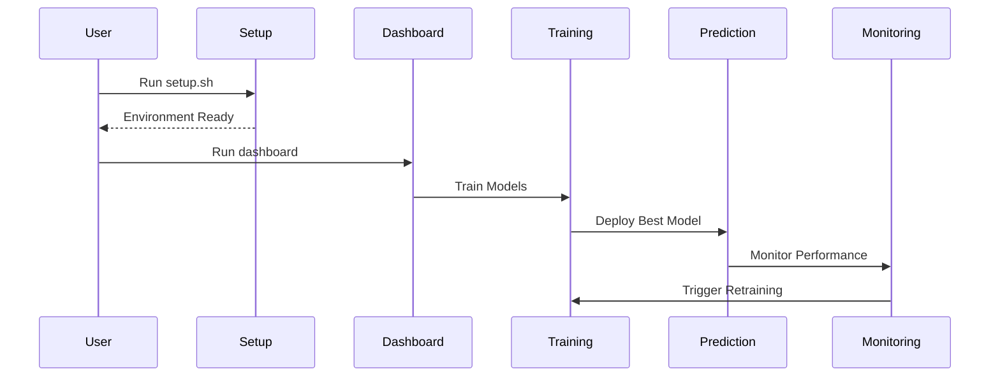
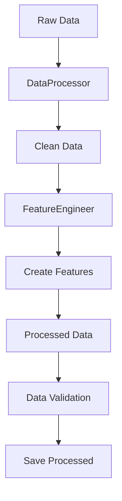
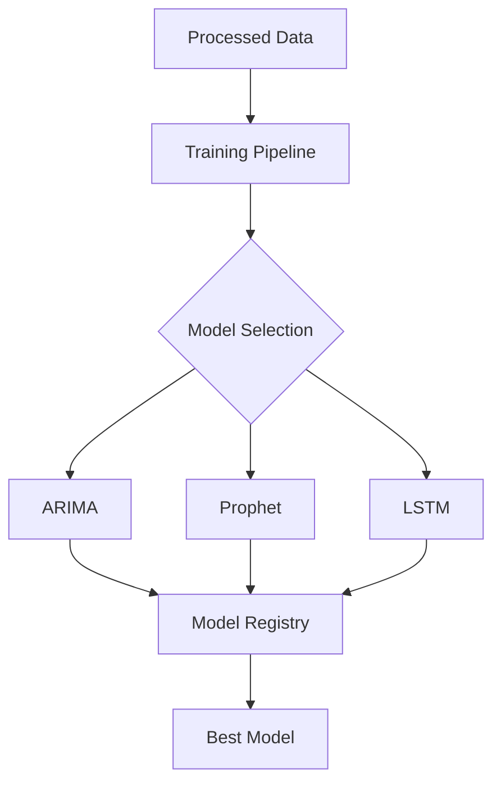
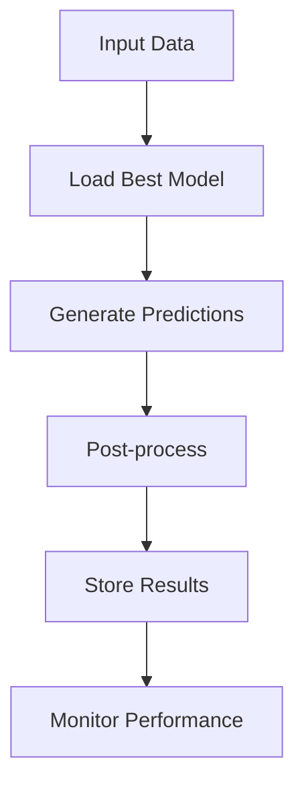
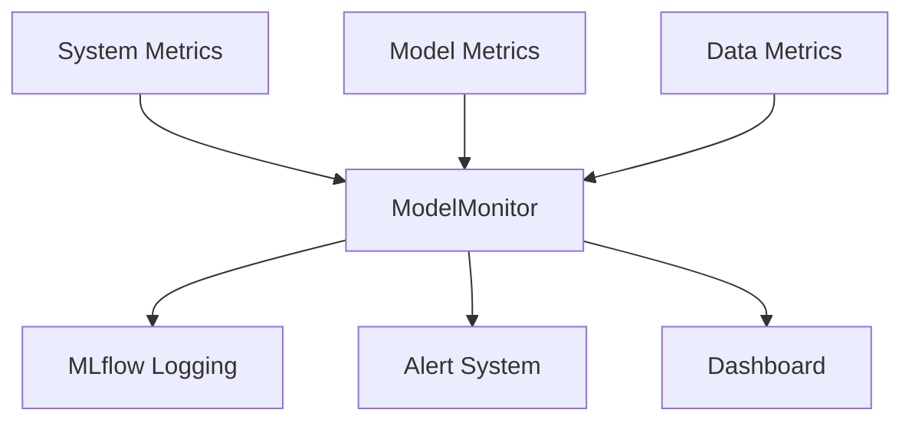
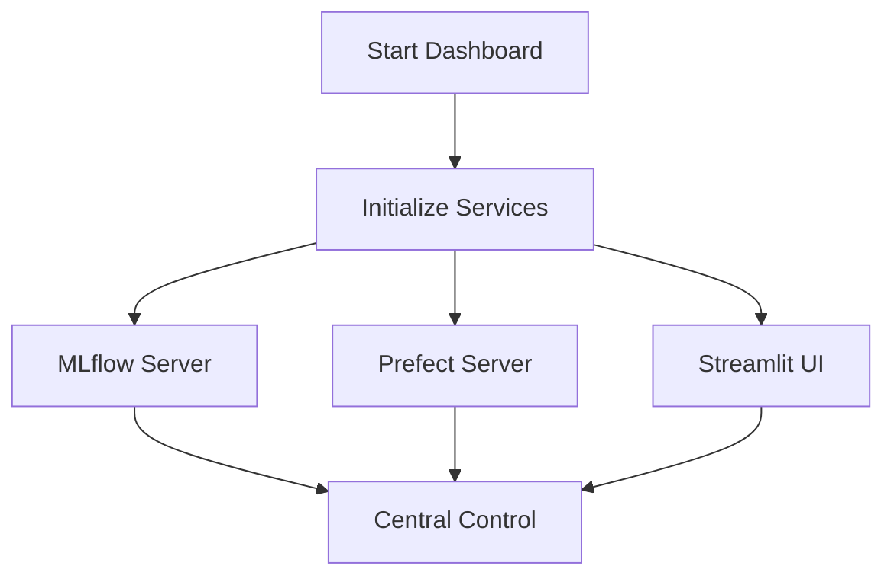
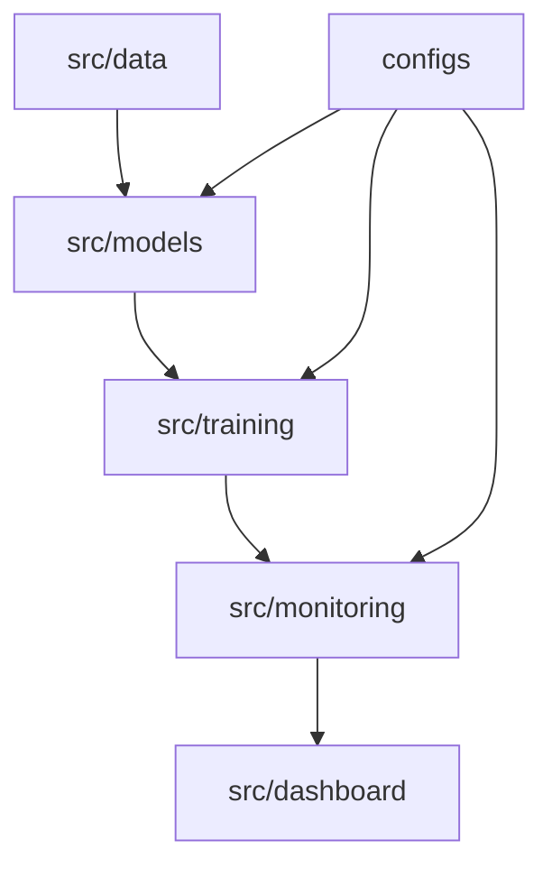
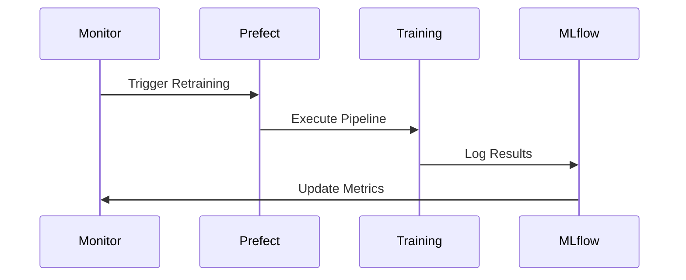
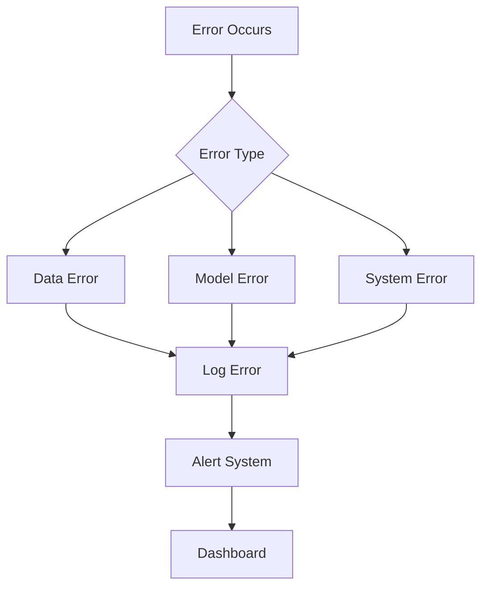

# Project Flow Documentation

## Complete System Flow



## 1. Initial Setup Flow

### Running setup.sh
```bash
$ chmod +x setup.sh
$ ./setup.sh
```

The setup script performs:

1. **Environment Check**:
   ```bash
   # Check Python version
   python_version=$(python3 -c 'import sys; print(".".join(map(str, sys.version_info[:2])))')
   if (( $(echo "$python_version < 3.8" | bc -l) )); then
       echo "❌ Python 3.8 or higher required"
       exit 1
   fi
   ```

2. **Directory Creation**:
   ```bash
   # Create project structure
   mkdir -p data/{raw,processed}
   mkdir -p models/{arima,prophet,lstm}
   mkdir -p logs/{training,api,monitoring}
   mkdir -p configs/{model_configs,training_configs}
   mkdir -p src/{data,models,training,monitoring,utils}
   ```

3. **Virtual Environment**:
   ```bash
   # Create and activate virtual environment
   python -m venv venv
   source venv/bin/activate
   pip install --upgrade pip
   pip install -r requirements.txt
   ```

4. **Configuration Files**:
   ```bash
   # Generate default configs
   echo "Creating default configurations..."
   # model_configs/default.yaml
   # training_configs/default.yaml
   # .env file
   ```

5. **Git Setup**:
   ```bash
   # Initialize git if not already done
   if [ ! -d ".git" ]; then
       git init
       cp .gitignore.template .gitignore
   fi
   ```

### Post-Setup Steps

1. **Activate Environment**:
   ```bash
   $ source venv/bin/activate
   ```

2. **Add Data**:
   ```bash
   $ cd data/raw
   $ kaggle competitions download -c store-sales-time-series-forecasting
   $ unzip store-sales-time-series-forecasting.zip
   ```

3. **Verify Setup**:
   ```bash
   $ python -m pytest tests/
   ```

## 2. Data Processing Flow



### Code Flow:

```python
# src/data/run_data_pipeline.py
from src.data.data_processor import DataProcessor
from src.data.feature_engineering import FeatureEngineer

# Initialize components
data_processor = DataProcessor()
feature_engineer = FeatureEngineer()

# Process data
raw_data = data_processor.load_data()
cleaned_data = data_processor.preprocess_data(raw_data)
features = feature_engineer.create_all_features(cleaned_data)
```

## 3. Model Training Flow



### Code Flow:

```python
# src/training/train_pipeline.py
from src.models import ARIMAModel, ProphetModel, LSTMModel
from src.training.train_pipeline import TrainingPipeline

# Initialize pipeline
pipeline = TrainingPipeline()

# Train models
models = {
    'arima': ARIMAModel(),
    'prophet': ProphetModel(),
    'lstm': LSTMModel()
}

for name, model in models.items():
    pipeline.train_model(model, train_data, validation_data)
```

## 4. Prediction Flow



### Code Flow:

```python
# src/models/predict.py
from src.monitoring.mlflow_tracking import MLflowTracker

# Load best model
mlflow_tracker = MLflowTracker()
best_run = mlflow_tracker.get_best_run()
model = mlflow_tracker.load_model(best_run.info.run_id)

# Generate predictions
predictions = model.predict(data, prediction_steps=30)
```

## 5. Monitoring Flow



### Code Flow:

```python
# src/monitoring/monitoring.py
from src.monitoring.monitoring import ModelMonitor

# Initialize monitor
monitor = ModelMonitor()

# Monitor various aspects
monitor.monitor_system_resources()
monitor.monitor_predictions(predictions)
monitor.monitor_data_drift(reference_data, current_data)
```

## 6. Dashboard Flow



### Starting the System:

1. **Start All Services**:
   ```bash
   $ ./run_dashboard.sh
   ```
   This script:
   - Starts MLflow server
   - Starts Prefect server
   - Launches Streamlit dashboard

2. **Access Points**:
   - Dashboard: http://localhost:8501
   - MLflow UI: http://localhost:5000
   - Prefect UI: http://localhost:4200

3. **Stop Services**:
   ```bash
   $ ./stop_services.sh
   ```

## 7. Module Dependencies



### Directory Structure:
```
project_root/
├── configs/
│   ├── model_configs/
│   │   └── default.yaml
│   └── training_configs/
│       └── default.yaml
├── data/
│   ├── processed/
│   └── raw/
├── logs/
│   ├── training/
│   ├── api/
│   └── monitoring/
├── models/
│   ├── arima/
│   ├── prophet/
│   └── lstm/
├── src/
│   ├── data/
│   ├── models/
│   ├── training/
│   ├── monitoring/
│   └── dashboard/
└── tests/
```

## 8. Configuration Flow

### Environment Variables (.env):
```bash
# MLflow settings
MLFLOW_TRACKING_URI=./mlruns
MLFLOW_EXPERIMENT_NAME=store_sales_forecasting

# Prefect settings
PREFECT_SERVER_API_HOST=0.0.0.0
PREFECT_SERVER_API_PORT=4200

# Model paths
MODEL_SAVE_PATH=./models
DATA_PATH=./data
```

### Model Configuration (configs/model_configs/default.yaml):
```yaml
arima:
  max_p: 5
  max_d: 2
  max_q: 5
  seasonal: true

prophet:
  seasonality_mode: multiplicative
  changepoint_prior_scale: 0.05

lstm:
  hidden_size: 64
  num_layers: 2
  dropout: 0.2
```

### Training Configuration (configs/training_configs/default.yaml):
```yaml
data:
  sequence_length: 30
  prediction_horizon: 15
  test_size: 0.2

training:
  batch_size: 32
  epochs: 100
  learning_rate: 0.001
```

## 9. Automated Retraining Flow



### Code Flow:

```python
# src/monitoring/prefect_workflows.py
from prefect import flow

@flow
def retrain_best_model(
    data: pd.DataFrame,
    schedule: str = "daily"
):
    """Automated retraining flow."""
    # Get best model
    best_model = get_best_model()
    
    # Retrain with new data
    pipeline = TrainingPipeline()
    pipeline.train_model(best_model, data)
```

## 10. Error Handling Flow



### Error Handling Strategy:

1. **Data Errors**:
   ```python
   try:
       processed_data = data_processor.process(raw_data)
   except DataValidationError as e:
       logger.error(f"Data validation failed: {e}")
       send_alert("data_validation", str(e))
   ```

2. **Model Errors**:
   ```python
   try:
       predictions = model.predict(data)
   except ModelError as e:
       logger.error(f"Prediction failed: {e}")
       send_alert("model_error", str(e))
   ```

3. **System Errors**:
   ```python
   try:
       monitor.check_resources()
   except ResourceError as e:
       logger.error(f"Resource check failed: {e}")
       send_alert("system_error", str(e))
   ```

## 11. Testing Flow

### Running Tests:
```bash
# Run all tests
$ python -m pytest tests/

# Run specific test file
$ python -m pytest tests/test_data_processor.py

# Run with coverage
$ python -m pytest --cov=src tests/
```

### Test Structure:
```
tests/
├── conftest.py              # Shared fixtures
├── test_data_processor.py   # Data processing tests
├── test_feature_engineering.py  # Feature engineering tests
├── test_models/            # Model-specific tests
│   ├── test_arima.py
│   ├── test_prophet.py
│   └── test_lstm.py
├── test_training.py        # Training pipeline tests
└── test_monitoring.py      # Monitoring tests
```

## 12. Deployment Flow

### Production Deployment:

1. **Build Environment**:
   ```bash
   $ ./setup.sh --env=production
   ```

2. **Start Services**:
   ```bash
   $ ./run_dashboard.sh --env=production
   ```

3. **Monitor Deployment**:
   ```bash
   $ ./monitor_deployment.sh
   ```

4. **Update System**:
   ```bash
   $ ./update_system.sh
   ```

### Development Deployment:

1. **Setup Development**:
   ```bash
   $ ./setup.sh --env=development
   ```

2. **Start Development Services**:
   ```bash
   $ ./run_dashboard.sh --env=development
   ```

3. **Run Tests**:
   ```bash
   $ python -m pytest tests/
   ```

This documentation provides a comprehensive overview of how all components in the system work together. Each section can be expanded further if more detail is needed. 