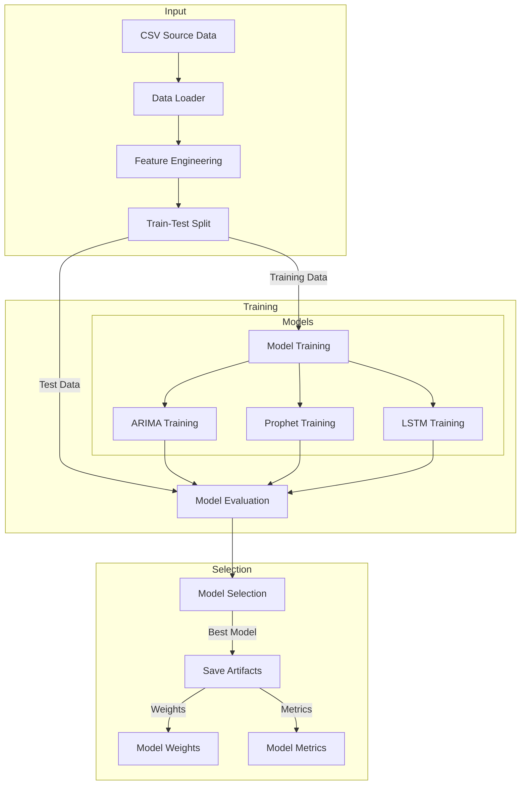
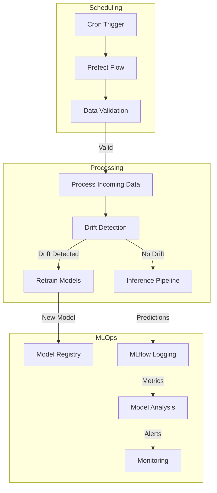

# Time Series Forecasting System Design

## System Overview

A scalable, monitored, and interpretable time series forecasting system that automatically handles both initial training (Day 0) and subsequent retraining (Day N) with model selection and MLOps integration.

## Data Flow Architecture

### Initial Training (Day 0)


### Continuous Operation (Day N)


## Component Details

### 1. Data Management
- **Source**: CSV files (extensible for future DB/API integration)
- **Validation**:
  - Schema validation
  - Data quality checks
  - Missing value detection
  - Anomaly detection
- **Feature Engineering**:
  - Time-based features
  - Lag features
  - Rolling statistics
  - Seasonal decomposition

### 2. Model Pipeline
- **Training Pipeline**:
  ```python
  # Pseudo-code flow
  class ModelPipeline:
      def train(self, data):
          features = self.feature_engineering(data)
          models = {
              'arima': train_arima(features),
              'prophet': train_prophet(features),
              'lstm': train_lstm(features)
          }
          best_model = self.select_best_model(models)
          self.save_artifacts(best_model)
  ```
- **Model Selection Criteria**:
  - Primary metrics: RMSE, MAE, MAPE
  - Secondary considerations: 
    - Inference speed
    - Model complexity
    - Resource usage

### 3. Prefect Integration
- **Scheduled Tasks**:
  ```python
  # Prefect flow structure
  @flow(name="forecasting_pipeline")
  def forecasting_pipeline():
      with TaskGroup("data_processing"):
          data = load_data()
          validated_data = validate_data(data)
          
      with TaskGroup("model_operations"):
          if is_day_zero():
              initial_training()
          else:
              incremental_update()
  ```
- **Monitoring Tasks**:
  - Data drift detection
  - Model performance tracking
  - Resource utilization
  - Error handling and retries

### 4. MLOps Components
- **Experiment Tracking** (MLflow):
  - Model parameters
  - Performance metrics
  - Training artifacts
  - Feature importance
- **Model Registry**:
  - Version control
  - A/B testing capability
  - Rollback mechanisms
- **Monitoring**:
  - Real-time performance metrics
  - Drift detection
  - Resource utilization
  - Alert system

## Scalability Considerations

### 1. Data Scalability
- Efficient data loading with chunking
- Parallel feature engineering
- Incremental training capabilities

### 2. Compute Scalability
- Distributed training support
- GPU acceleration for LSTM
- Batch prediction optimization

### 3. Storage Scalability
- Efficient model artifact storage
- Metric compression strategies
- Historical data management

## Monitoring Strategy

### 1. Performance Monitoring
- Model accuracy metrics
- Prediction latency
- Resource utilization
- Error rates

### 2. Data Monitoring
- Data quality metrics
- Drift detection
- Feature distribution changes
- Missing value patterns

### 3. System Monitoring
- Pipeline execution status
- Resource utilization
- API health (future)
- Storage utilization

## Interpretability Features

### 1. Model Insights
- Feature importance analysis
- Model confidence scores
- Prediction intervals
- Anomaly detection

### 2. Debugging Tools
- Training history logs
- Performance degradation analysis
- Data drift reports
- Model comparison tools

### 3. Visualization
- Time series decomposition
- Feature correlation analysis
- Prediction vs Actual plots
- Error analysis dashboards

## Future Extensions

1. **API Integration**
   - REST API for real-time predictions
   - Batch prediction endpoints
   - Model metadata API

2. **Database Integration**
   - Time-series database support
   - Distributed storage options
   - Caching layer

3. **Advanced Features**
   - Automated hyperparameter tuning
   - Ensemble methods
   - Online learning capabilities
   - Custom model integration 