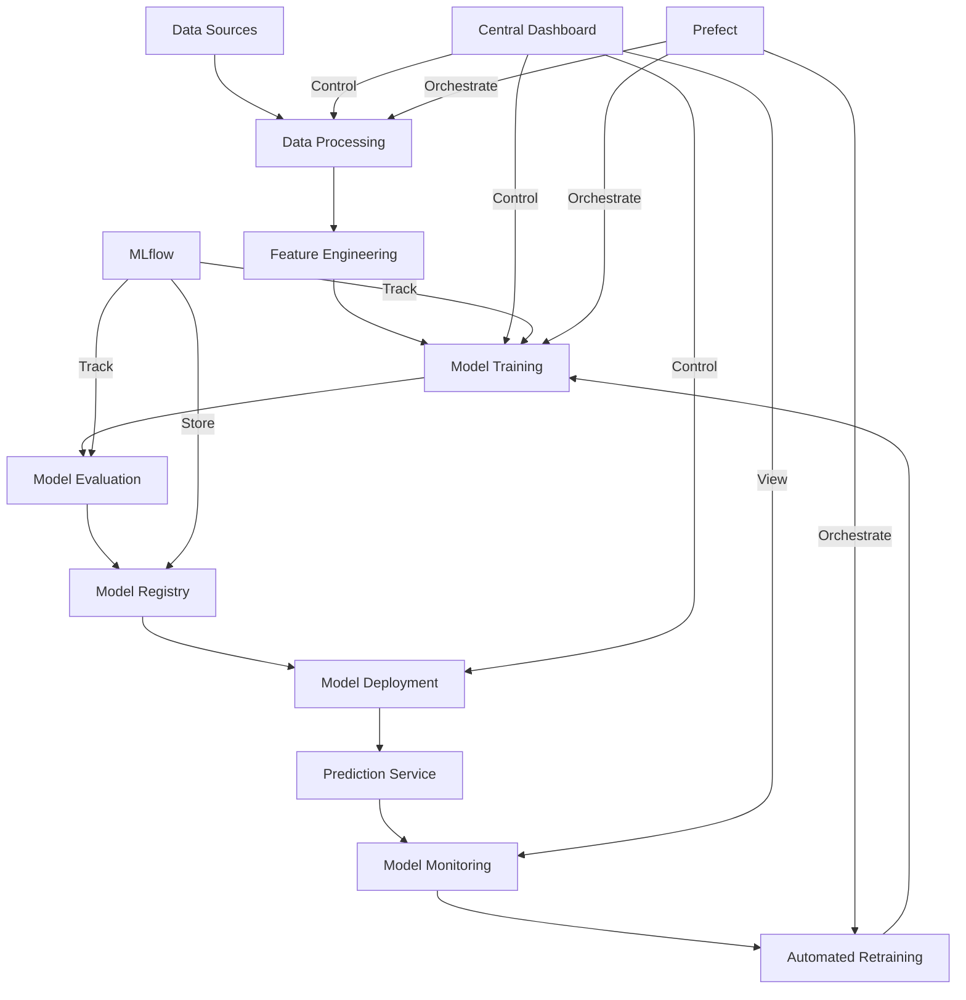
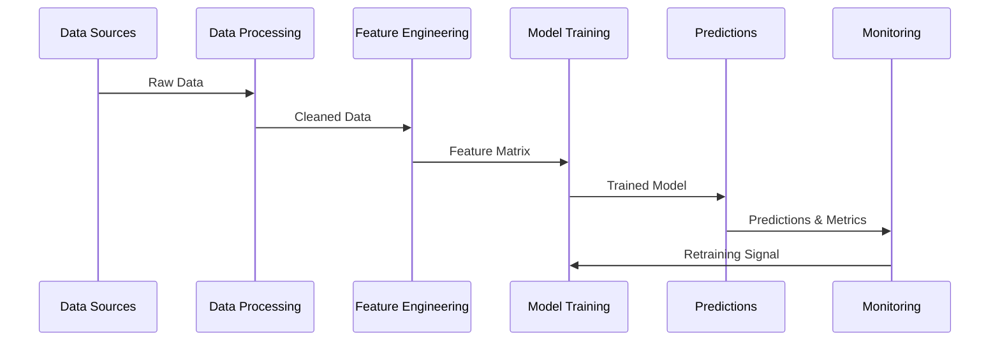
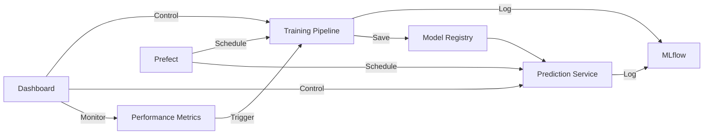

# System Overview

## Project Architecture

The Store Sales Time Series Forecasting System is built with a modular, scalable architecture that follows MLOps best practices. The system consists of several key components that work together to provide end-to-end functionality from data processing to model deployment and monitoring.

### High-Level Architecture



## Key Components

### 1. Data Processing Pipeline
- **Purpose**: Handle data ingestion, cleaning, and preprocessing
- **Location**: `src/data/`
- **Key Files**:
  - `data_processor.py`: Core data processing logic
  - `feature_engineering.py`: Feature creation and selection
  - `run_data_pipeline.py`: Pipeline execution script

### 2. Model Framework
- **Purpose**: Provide unified interface for all models
- **Location**: `src/models/`
- **Key Files**:
  - `base_model.py`: Abstract base class for models
  - `arima_model.py`: ARIMA implementation
  - `prophet_model.py`: Prophet implementation
  - `lstm_model.py`: LSTM implementation

### 3. Training Pipeline
- **Purpose**: Manage model training and evaluation
- **Location**: `src/training/`
- **Key Files**:
  - `train_pipeline.py`: Training orchestration
  - `hyperparameter_optimization.py`: Parameter tuning

### 4. Monitoring System
- **Purpose**: Track model and system health
- **Location**: `src/monitoring/`
- **Key Files**:
  - `mlflow_tracking.py`: Experiment tracking
  - `prefect_workflows.py`: Workflow orchestration
  - `monitoring.py`: System monitoring

### 5. Dashboard
- **Purpose**: Central control and visualization
- **Location**: `src/dashboard/`
- **Key Files**:
  - `app.py`: Streamlit dashboard application

## Technology Stack

### Core Technologies
- **Python 3.8+**: Primary programming language
- **pandas & numpy**: Data manipulation
- **scikit-learn**: Feature processing and evaluation
- **statsmodels**: Statistical analysis
- **PyTorch**: Deep learning (LSTM)

### Models
- **ARIMA**: Statistical time series forecasting
- **Prophet**: Facebook's forecasting tool
- **LSTM**: Deep learning for sequence prediction

### MLOps Tools
- **MLflow**: Experiment tracking and model registry
- **Prefect**: Workflow orchestration
- **Streamlit**: Dashboard interface

### Monitoring & Logging
- **Python logging**: Application logs
- **MLflow metrics**: Model performance
- **Prefect monitoring**: Workflow status
- **System metrics**: Resource utilization

## System Requirements

### Hardware Requirements
- **CPU**: 4+ cores recommended
- **RAM**: 8GB minimum, 16GB recommended
- **Storage**: 20GB minimum
- **GPU**: Optional, recommended for LSTM training

### Software Requirements
- **Operating System**: Linux (Ubuntu 20.04+)
- **Python**: Version 3.8 or higher
- **pip**: Latest version
- **git**: For version control
- **virtualenv**: For environment management

### Network Requirements
- **Ports**:
  - 8501: Streamlit dashboard
  - 5000: MLflow server
  - 4200: Prefect server
- **Internet access**: Required for package installation

## Data Flow



## Control Flow



## Directory Structure

```
project_root/
├── configs/
│   ├── model_configs/
│   └── training_configs/
├── data/
│   ├── processed/
│   └── raw/
├── docs/
├── logs/
├── models/
├── notebooks/
├── src/
│   ├── data/
│   ├── models/
│   ├── training/
│   ├── monitoring/
│   └── dashboard/
└── tests/
```

## Security Considerations

1. **Data Security**
   - Raw data is stored in secure location
   - Access controlled through permissions
   - Sensitive information is encrypted

2. **API Security**
   - Authentication required for API access
   - Rate limiting implemented
   - HTTPS encryption in production

3. **Model Security**
   - Model versioning for rollback
   - Access control for model registry
   - Validation of model inputs

4. **System Security**
   - Regular security updates
   - Firewall configuration
   - Access logging and monitoring

## Scalability

The system is designed to scale in several dimensions:

1. **Data Volume**
   - Batch processing capability
   - Efficient data storage
   - Optimized query patterns

2. **Model Complexity**
   - Multiple model support
   - Parallel training
   - GPU utilization

3. **User Load**
   - Horizontal scaling
   - Load balancing
   - Caching strategies

4. **Storage**
   - Modular storage backend
   - Configurable retention
   - Archive functionality 